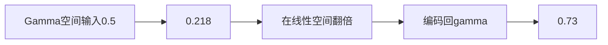
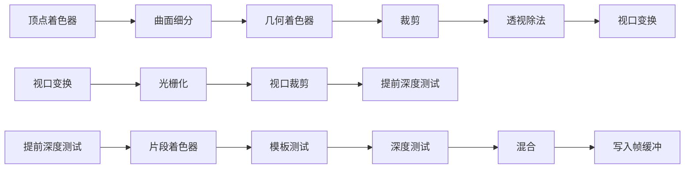

#### Gamma校正

显示器在电压与亮度之间存在**非线性响应**。 亮度增长比电压增长==更快==，这种现象常用“伽马（gamma）”来描述

如果亮度 \(L\) 与输入电压 \(V\) 的关系大致是：

$$
L \propto V^{2.2}
$$

那么当电压加倍时：

$$
(2V)^{2.2} = 2^{2.2} \cdot V^{2.2}
$$

大约等于 **4.6**倍。

- 人眼对亮度的感知是非线性的，显示器的亮度响应也是非线性的（约 𝑉^2.2），Gamma 校正就是用一个“反非线性”去抵消显示器的非线性，让最终看到的亮度变化是线性的
- 你以为 0.5 → 1.0 才是亮度加倍，但因为显示器是 2.2 次幂非线性，实际上只要从 0.5 提升到 0.73 就能让人眼看到亮度翻倍
- 如果把颜色从 0.5 提到 1.0，显示器上亮度会变成约 4.6 倍




#### 抗锯齿无效？

glfwWindowHint(GLFW_SAMPLES, 4);设置后并未出现抗锯齿，是因为此前在【Nvidia控制面板】中3D设置选择了【性能】

##### 多重采样抗锯齿(Multisample Anti-aliasing, MSAA)
传统渲染中，一个像素只有 一个采样点，通常在像素中心，一个像素内部放多个采样点，用这些点的覆盖情况来决定像素最终颜色，从而让边缘更平滑：4x覆盖率更高，所以更容易“认定”像素被图元覆盖，更还原。
```
[单采样]        +-------+       [MSAA 4x]      +-------+
               |       |                      | • / • |
               |   •   |                      |  /    |
               |       |                      | •    •|
               +-------+                      +-------+
```
MSAA 只对每个像素运行一次片段着色器，而不是对每个子采样点运行一次，子采样点数量（4x、8x）不会增加片段着色器运行次数

- 片段着色器运行一次 → 得到一个颜色值
- 这个颜色值被写入所有“被覆盖”的子采样点
- 最后根据==覆盖率==进行混合

MSAA 的取舍
- 不增加片段着色器次数
- 只对子采样点计算：覆盖率 + 深度，用覆盖率来混合颜色 → 得到平滑边缘

------


>  OpenGL 的规范规定：单个顶点属性比如Mat4最多只能有 4 个分量（vec4）

------

>  顶点属性总数有限制（OpenGL Core 至少支持 16 个）

------

#### 显卡对 `uniform` 数量有限制，数据太多会超出上限

使用 **实例化数组**：用 glVertexAttribDivisor 设置为逐实例更新
glVertexAttribDivisor(2, 1);将属性除数设置为1，是在告诉OpenGL，处于位置值2的顶点属性是一个实例化数组

> 法向量在模型空间，在GS中计算时要保持空间一致

### 高级GLSL

| 变量             | 作用                               |
| ---------------- | ---------------------------------- |
| gl_VertexID  | “这是第几个点”，用来生成位置 |
| gl_PointSize | 控制“这个点有多大”                 |
| gl_FragCoord.xy | 单位像素，当前片元在屏幕上的像素位置          |
| gl_FrontFacing | 当前片段是属于正向面的一部分还是背向面的一部分          |





#### Cube示意图

       2________ 3
       /|      /|
     6/_|____7/ |
      | |_____|_|
      | /0    | /1
      |/______|/
      4       5


### 这么多缓冲，那glfwSwapBuffers 在交换什么缓冲？

- 默认帧缓冲的颜色缓冲才会被 `glfwSwapBuffers` 交换显示

- 深度/模板缓冲只是绘制辅助，不参与交换

- 自定义 帧缓冲 是你自己额外的画布，结果不会自动显示，必须再绘制到默认帧缓冲才能出现在屏幕上

###  什么是帧缓冲（Frame Buffer）

**帧缓冲**是图形渲染管线中的一个核心概念，本质上是显存中的一块区域，用来存储一帧图像在生成过程中的所有数据。它是 GPU 渲染结果的“临时容器”，最终会被送到显示器显示。

####  帧缓冲的组成

一个完整的帧缓冲通常包含多个缓冲区：

- **颜色缓冲（Color Buffer）**   存储每个像素的颜色值（RGBA），最终显示在屏幕上的图像就来自这里。
- **深度缓冲（Depth Buffer / Z-Buffer）**   存储每个像素的深度信息，用来决定前后遮挡关系。
- **模板缓冲（Stencil Buffer）**   存储额外的整数值，用来做条件过滤（例如只绘制某些区域）。
- **可选的附加缓冲**   比如多重渲染目标（MRT）、多重采样缓冲（MSAA）、累积缓冲等。

目前所做的所有操作都是在默认帧缓冲的渲染缓冲上进行的，==OpenGL允许我们定义我们自己的帧缓冲，也就是说我们能够定义我们自己的颜色缓冲，甚至是深度缓冲和模板缓冲。==但需要添加以上提到缓冲的附件：当创建一个附件的时候有两个选项：==纹理附件==或==渲染缓冲对象(Renderbuffer Object)附件==
> 纹理附件：可颜色纹理采样、深度纹理采样
> 渲染缓冲对象：只能写入，不能在着色器里读取，优势是性能优化
##### 什么时候使用纹理附件或渲染缓冲对象(Renderbuffer Object)附件？。

通常的规则是：

- 如果不需要从一个缓冲中==采样==（在着色器里读取纹理数据）数据，使用渲染缓冲对象

- 如果需要从缓冲中采样颜色或深度值等数据，应该选择纹理


### 面剔除（通过少绘制片段提升性能）

在图形学中，顶点顺序必须统一，否则渲染管线无法正确区分正面和背面。OpenGL/WebGL 默认把“逆时针 (CCW)”顶点顺序当作正面，而 Blender 导出的模型通常也是按照逆时针顺序来定义面的。

#### 🔑 为什么要用逆时针顺序

- **正反面判定**：渲染引擎通过顶点顺序来判断三角形的朝向。==逆时针 → 正面==，顺时针 → 背面。
- **背面剔除 (Cull)**：如果顶点顺序混乱，GPU可能会把本该显示的面剔除掉，或者错误地显示背面。
- **法线计算**：顶点顺序决定了三角形法线的方向。用右手法则，逆时针顶点顺序对应的法线指向观察者，这样光照和阴影才正确。
- **一致性**：所有三角形必须遵循同一约定，否则渲染结果会出现“破洞”或“闪烁”。

#### 📐 Blender 默认导出的顶点顺序

- Blender 在内部使用 **右手坐标系**，并且默认将 **逆时针 (CCW)** 顶点顺序作为正面。
- 当你导出 OBJ、FBX 等格式时，Blender 会保持这种约定：
  - **OBJ 文件**：面数据 (`f`) 默认按逆时针顺序排列顶点。
  - **FBX 文件**：同样遵循逆时针作为正面。
- 如果你在 Blender 中翻转法线或修改面方向，导出的顶点顺序也会随之改变。

### 混合涉及的两种颜色

当你调用

```
glEnable(GL_BLEND);
glBlendFunc(GL_SRC_ALPHA, GL_ONE_MINUS_SRC_ALPHA);
```

之后，混合方程会在 **片段着色器输出的颜色** 和 **当前帧缓冲中已有的颜色** 之间进行计算。

- **片段颜色 (Source Color)**   👉 指的是==片段着色器==（Fragment Shader）输出的颜色值，也就是你刚刚要写入到颜色缓冲的那个颜色。 在混合函数里，它通常叫做 **Source**。
- **缓冲颜色 (Destination Color)**   👉 指的是颜色缓冲区里==已经存在的颜色值，也就是之前绘制的结果==。 在混合函数里，它通常叫做 **Destination**。

### 点光源衰减公式

$$
F_{att} = \frac{1.0}{K_c + K_l \cdot d + K_q \cdot d^2}
$$

- Fatt：衰减因子 (attenuation factor)

- Kc：常数项 (constant term)

- Kl：线性项 (linear term)

- Kq：二次项 (quadratic term)

- d：片元到光源的距离

### 一个向量如何判断是方向还是位置？（齐次坐标的规则）

- ==**位置向量 (point)**： 用 (x,y,z,1.0)== 表示。
  - 当 w=1 时，矩阵中的平移部分会对它生效。
  - 这样才能正确地把点从一个坐标系变换到另一个坐标系。
- ==**方向向量 (vector)**： 用 (x,y,z,0.0)==表示。
  - 当 w=0 时，矩阵中的平移部分不会影响它。
  - 因为方向只表示“指向”，没有具体位置，不应该被平移。

#### ⚙️ 为什么要这样区分

矩阵变换通常写成 4×4 的形式：

$$
\begin{pmatrix}
R & T \\
0 & 1
\end{pmatrix}
$$


其中 RR 是旋转/缩放，TT 是平移。

- 对位置向量 (x,y,z,1)：
$$
\begin{pmatrix} R & T \\ 0 & 1 \end{pmatrix}
\cdot
\begin{pmatrix} x \\ y \\ z \\ 1 \end{pmatrix}
=
R \cdot \begin{pmatrix} x \\ y \\ z \end{pmatrix} + T
$$
→ 平移生效。

- 对方向向量 (x,y,z,0)：
$$
\begin{pmatrix} R & T \\ 0 & 1 \end{pmatrix}
\cdot
\begin{pmatrix} x \\ y \\ z \\ 0 \end{pmatrix}
=
R \cdot \begin{pmatrix} x \\ y \\ z \end{pmatrix}
$$
→ 平移部分被消除，只剩旋转/缩放。

### 光照

#### 风氏光照模型(Phong Lighting Model)

风氏光照模型的主要结构由3个分量组成：

环境(Ambient)、漫反射(Diffuse)和镜面(Specular)光照

##### 核心公式

总光照：
$$
I=Ia+Id+Is
$$

- **环境光** Ia**：**
$$
Ia=ka⋅La
$$

- **漫反射** Id**：**
$$
Id=kd⋅Ld⋅max⁡(dot(N,L),0)
$$

- **镜面高光** Is**：**
$$
Is=ks⋅Ls⋅[max⁡(dot(R,V),0)]n
$$

其中

- N：法线方向（单位向量）
- L：从片元指向光源的方向（单位向量）
- V：从片元指向相机的方向（单位向量）
- R：光线相对法线的反射方向（`reflect` 计算）
- ka,kd,ks：材质环境/漫反射/镜面系数
- La,Ld,Ls：光源环境/漫反射/镜面颜色
- n：高光指数（shininess）
##### 典型计算shader
```c
#version 330 core

in vec3 FragPos;
in vec3 Normal;

out vec4 FragColor;

// 光源
uniform vec3 lightPos;
uniform vec3 lightAmbient;
uniform vec3 lightDiffuse;
uniform vec3 lightSpecular;

// 视点
uniform vec3 viewPos;

// 材质 单色或者是纹理
uniform vec3 materialAmbient;
uniform vec3 materialDiffuse;
uniform vec3 materialSpecular;
uniform float materialShininess;

void main()
{
    // 1. 环境光
    vec3 ambient = lightAmbient * materialAmbient;

    // 2. 漫反射
    vec3 norm = normalize(Normal);
    vec3 lightDir = normalize(lightPos - FragPos);
    float diff = max(dot(norm, lightDir), 0.0);
    vec3 diffuse = lightDiffuse * (diff * materialDiffuse);

    // 3. 镜面高光（Phong：用反射向量 + 视线向量）
    vec3 viewDir = normalize(viewPos - FragPos);
    vec3 reflectDir = reflect(-lightDir, norm); // 注意 lightDir 要取反
    float specAngle = max(dot(viewDir, reflectDir), 0.0);
    float spec = pow(specAngle, materialShininess);
    vec3 specular = lightSpecular * (spec * materialSpecular);

    vec3 result = ambient + diffuse + specular;
    FragColor = vec4(result, 1.0);
}

```
###### 漫反射(Diffuse)
漫反射光照使物体上与光线方向越接近的片段能从光源处获得更多的亮度

漫反射公式
$$
I_{diffuse} = k_d \cdot I_l \cdot \max(0, \mathbf{N} \cdot \mathbf{L})
$$
- kd：材质的漫反射系数（通常就是物体颜色 objectColor） 
- 𝐼𝑙：光源颜色/强度（就是 lightColor）  
- 𝑁：单位化的表面法线向量 
- 𝐿：单位化的光照方向向量（光源位置 - 片元位置） 
- max (0 ,𝑁 ⋅ 𝐿 ) ：余弦定律，保证夹角大于 90° 时光照为 0
```c
vec3 norm = normalize(Normal);              // → 公式里的 N
vec3 lightDir = normalize(lightPos - FragPos); // → 公式里的 L

float diff = max(dot(norm, lightDir), 0.0); // → 公式里的 max(0, N·L)

vec3 diffuse = diff * lightColor * objectColor; 
// → k_d * I_l * max(0, N·L)
```
#### 镜面(Specular)光照

镜面光照也决定于光的方向向量和物体的法向量，但是它也决定于观察方向

$$
I_{diffuse} = k_d \cdot I_l \cdot \max(0, \mathbf{N} \cdot \mathbf{L})
$$

```c
// 镜面（Phong）
vec3 V = normalize(viewPos  - FragPos);
vec3 R = reflect(-L, N);
float specFactor = pow(max(dot(R, V), 0.0), shininess);
vec3 specular = specFactor * lightColor * specColor;
```

#### 基础颜色调制模拟光照(Ambient)

```c
FragColor = vec4(lightColor * objectColor, 1.0);
```
- 不是任何标准光照模型（比如 Lambert 漫反射、Phong、Blinn-Phong）
- 没有考虑光的位置、方向、法线、衰减等因素
- 物体的基色被光的颜色调制


#### VBO/VAO 的常规流程：生成 → 绑定 → 上传数据 → 设置属性 → 使用 → 解绑
##### VBO（顶点缓冲对象）操作流程
```c
// 生成缓冲对象
GLuint VBO;
glGenBuffers(1, &VBO);
// 绑定缓冲对象
glBindBuffer(GL_ARRAY_BUFFER, VBO);
// 上传数据到显存
glBufferData(GL_ARRAY_BUFFER, sizeof(vertices), vertices, GL_STATIC_DRAW);
// 设置顶点属性指针
glVertexAttribPointer(0, 3, GL_FLOAT, GL_FALSE, 3 * sizeof(float), (void*)0);
glEnableVertexAttribArray(0);
// 这两处的 0 表示你要描述 位置属性（通常在顶点着色器里写成 layout (location = 0) in vec3 aPos;）
```
##### VAO（顶点数组对象）操作流程
```c
// 生成 VAO
GLuint VAO;
glGenVertexArrays(1, &VAO);
// 绑定 VAO
glBindVertexArray(VAO);
// 绑定并配置 VBO
// 解绑 VAO
glBindVertexArray(0);
```
使用时
```c
glBindVertexArray(VAO);
glDrawArrays(GL_TRIANGLES, 0, 3);
glBindVertexArray(0);
```

#### opengl加载obj的blender转换
导出obj时blender4.2需要勾选copy path导出，这样mtl中包含纹理信息

https://learnopengl-cn.github.io/01%20Getting%20started/01%20OpenGL/
#### OpenGL到底是什么
包含了一系列可以操作图形、图像的函数。然而，OpenGL本身并不是一个API，它仅仅是一个由Khronos组织制定并维护的规范

- OpenGL规范严格规定了每个函数该如何执行，以及它们的输出值。至于内部具体每个函数是如何实现的，
将由OpenGL库的开发者自行决定
- OpenGL的大多数实现都是由显卡厂商编写

早期的OpenGL使用立即渲染模式，效率太低，从OpenGL3.2开始，规范文档开始废弃立即渲染模式，鼓励开发者在OpenGL的核心模式

从OpenGL3.2开始，规范文档开始废弃立即渲染模式

##### 双缓冲(Double Buffer)
前缓冲保存着最终输出的图像，会在屏幕上显示；而所有的的渲染指令都会在后缓冲上绘制。
当所有的渲染指令执行完毕后，我们交换(Swap)前缓冲和后缓冲，这样图像就立即呈显出来glfwSwapBuffers(window);

#### 三角形
顶点数组对象：Vertex Array Object，VAO
顶点缓冲对象：Vertex Buffer Object，VBO
元素缓冲对象：Element Buffer Object，EBO 或 索引缓冲对象 Index Buffer Object，IBO

#### 图形渲染管线（Graphics Pipeline）
3D坐标转为2D坐标的处理过程由管线管理
实际上指的是一堆原始图形数据途经一个输送管道，期间经过各种变化处理最终出现在屏幕的过程。

###### 着色器(Shader)：
图形渲染管线可以被划分为几个阶段，每个阶段将会把前一个阶段的输出作为输入。
当今大多数显卡都有成千上万的小处理核心，它们在GPU上为每一个（渲染管线）阶段运行各自的小程序，从而在图形渲染管线中快速处理你的数据。
这个小程序就叫着色器

###### 图元(Primitive)：
为了让OpenGL知道我们的坐标和颜色值构成的到底是什么，OpenGL需要指定这些数据所表示的渲染类型。
我们是希望把这些数据渲染成一系列的点？一系列的三角形？还是仅仅是一个长长的线？
做出的这些提示叫做图元(Primitive)，任何一个绘制指令的调用都将把图元传递给OpenGL。GL_POINTS、GL_TRIANGLES、GL_LINE_STRIP。

图元就是 GPU 能直接绘制的最基本几何形状，点线面，光栅化前接收==图元==，在光栅化后产生==片段==。片段不是最终像素，它是：光栅化阶段生成的“像素候选者”，包含颜色、深度、纹理坐标等信息。

###### 顶点缓冲对象(Vertex Buffer Objects, VBO)
顶点着色器会在GPU上创建内存用于储存顶点数据
通过VBO管理这个内存，它会在GPU内存（通常被称为显存）中储存大量顶点。
使用这些缓冲对象的好处是我们可以一次性的发送一大批数据到显卡上，而不是每个顶点发送一次。从CPU把数据发送到显卡相对较慢，所以要尝试尽量一次性发送尽可能多的数据
##### 绑定
OpenGL有很多缓冲对象类型，顶点缓冲对象的缓冲类型是GL_ARRAY_BUFFER。OpenGL允许我们同时绑定多个缓冲，只要它们是不同的缓冲类型。
glBindBuffer(GL_ARRAY_BUFFER, VBO);这一刻起，我们使用的任何（在GL_ARRAY_BUFFER目标上的）缓冲调用都会用来配置当前绑定的缓冲(VBO)
